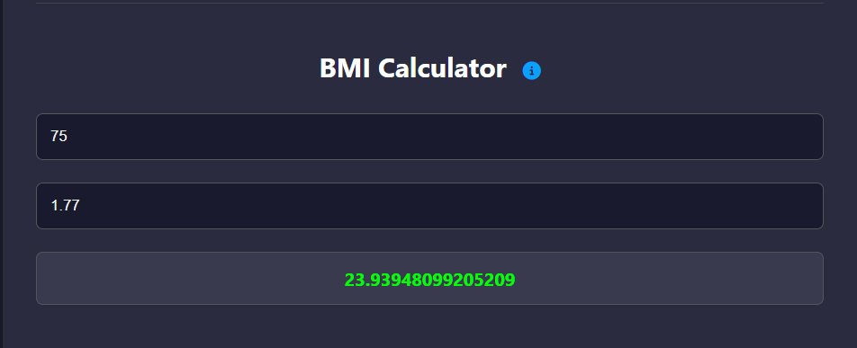

# تمرین دستگرمی اول درس برنامه سازی وب

# ماشین‌حساب پویا

یک ماشین‌حساب تعاملی تحت وب که به‌طور کامل با HTML، CSS و JavaScript ساخته شده است. این پروژه با نمایش سه ماشین‌حساب پویا — هزینه (Fee)، شاخص توده بدنی (BMI) و معدل (GPA) — به تمرین دست‌کاری درخت DOM می‌پردازد. ماشین‌حساب GPA امکان اضافه یا حذف دروس را در لحظه فراهم کرده و همراه با اعتبارسنجی و مدیریت خطا، همگی در یک رابط کاربری ارائه شده‌اند.

---

## فهرست مطالب

- [معرفی پروژه](#معرفی-پروژه)
- [ویژگی‌ها](#ویژگی‌ها)
- [فناوری‌ها](#فناوری‌ها)
- [ساختار فایل‌ها](#ساختار-فایل‌ها)
- [جزئیات پیاده‌سازی](#جزئیات-پیاده‌سازی)
  - [HTML](#html)
  - [CSS](#css)
  - [JavaScript](#javascript)
- [تصاویر](#تصاویر)
- [نحوه اجرا](#نحوه-اجرا)
- [بهبودهای آتی](#بهبودهای-آتی)
- [مجوز](#مجوز)

---

## معرفی پروژه

این پروژه به عنوان بخشی از تمرین درسی در دورۀ برنامه‌نویسی وب توسعه یافته است و هدف آن تمرین پیمایش درخت DOM و مدیریت رویدادها بوده است. این اپلیکیشن نتایج را به‌صورت آنی محاسبه می‌کند، ورودی‌ها را اعتبارسنجی می‌کند و خطاها را به‌صورت بصری نمایش می‌دهد.

## ویژگی‌ها

- **ماشین‌حساب هزینه:** محاسبۀ هزینۀ نهایی با فرمول  
  `count * fee - discount`.
- **ماشین‌حساب BMI:** محاسبۀ شاخص تودۀ بدنی با فرمول  
  `weight / (height * height)`.
- **ماشین‌حساب GPA:** ورودی سطری برای چند درس، محاسبه میانگین وزنی با فرمول  
  `Σ(grade × credit) / Σ(credit)`.
- اعتبارسنجی زنده برای جلوگیری از ورود داده‌های نامعتبر یا مقادیر منفی.
- رابط کاربری Dark Mode همراه با آیکون‌های راهنما (tooltip) برای نمایش فرمول‌ها.

## فناوری‌ها

- **HTML5**
- **CSS3**
- **JavaScript** با استفاده از کلاس‌های ES6
- **Font Awesome** برای آیکون‌های اطلاعات

## ساختار فایل‌ها

├── index.html  
├── index.css  
├── formula.js  
└── README.md

## جزئیات پیاده‌سازی

### فایل HTML

- از تگ سفارشی `<formula>` برای نمایش خروجی‌ها استفاده شده است.
- ورودی‌های هر بخش دارای `id` یا `class` مناسب جهت ارجاع در فرمول‌ها هستند.
- آیکون‌های اطلاعاتی با استفاده از Font Awesome به کاربر کمک می‌کنند تا فرمول را با هاور مشاهده کند.

### فایل CSS

- استفاده از پس‌زمینه تاریک (`#1e1e2f`) و متن با کنتراست بالا جهت دسترسی بهتر.
- انیمیشن‌های نرم هنگام فوکوس و هاور جهت تجربه بهتر کاربری.
- استفاده از کلاس `.invalid` برای نمایش خطا به رنگ قرمز.

### فایل JavaScript

تمامی منطق پویا در یک کلاس ES6 به نام **FormulaEvaluator** در فایل `formula.js` پیاده‌سازی شده است.

#### راه‌اندازی و مدیریت رویدادها

- **سازنده کلاس:** پس از بارگذاری کامل DOM، تگ‌های `<formula>` را پیدا کرده، رویدادها را ثبت کرده و اولین محاسبه را انجام می‌دهد.
- **ورودی سراسری:** با استفاده از `input` روی `document`، تغییرات در هر فیلد باعث به‌روزرسانی خروجی می‌شود.
- **مدیریت رویداد به روش Delegation:** دکمه‌های GPA برای افزودن یا حذف سطرها، با استفاده از delegation مدیریت می‌شوند تا نیاز به ثبت مجدد رویداد پس از افزودن سطر نباشد.

#### ارزیابی فرمول‌ها (`evaluateFormula`)

1. **تشخیص نوع ماشین‌حساب:** اگر `evaluator="calculateGPA"` باشد، منطق GPA اجرا می‌شود. در غیر این صورت فرمول ریاضی ساده پردازش می‌شود.

2. **منطق GPA:**

   - پیمایش روی `.gpa-row`ها و دریافت مقادیر ورودی.
   - اعتبارسنجی داده‌ها (عددی بودن، مثبت بودن).
   - محاسبه مجموع نمره × واحد، تقسیم بر مجموع واحدها.

3. **منطق فرمول عمومی:**

   - استخراج شناسه‌ها با regex (`/\\b[a-zA-Z_]\\w*\\b/g`).
   - ساخت context از ورودی‌ها و اعتبارسنجی با الگوی عددی دقیق.
   - اجرای فرمول با  
     `new Function(...args, return ${expr};)` به جای eval.
   - حذف کلاس `.invalid` در صورت موفقیت.

4. **مدیریت خطا:** در صورت خطا در ورودی یا فرمول، پیام «Invalid Formula» نمایش داده می‌شود و کلاس `.invalid` فعال می‌شود.

#### مدیریت سطرهای GPA

- **addGpaRow():** اضافه‌کردن سطر جدید همراه با فیلدهای ورودی و دکمه حذف.
- **removeGpaRow():** حذف سطر مربوط به دکمه کلیک‌شده و بروزرسانی فوری خروجی.

#### کارایی و قابلیت نگهداری

- تمام عملیات DOM محدود و بهینه‌سازی‌شده برای جلوگیری از رندرهای اضافی.
- استفاده از یک کلاس مشترک برای همه بخش‌ها، رعایت اصل DRY و قابلیت توسعه در آینده.

## تصاویر

| ویژگی                              | تصویر                                  |
| ---------------------------------- | -------------------------------------- |
| ماشین‌حساب هزینه                   |       |
| ماشین‌حساب هزینه + info            |        |
| ماشین‌حساب هزینه + invalid formula |  |
| ماشین‌حساب BMI                     |       |
| ماشین‌حساب BMI + info              |        |
| ماشین‌حساب BMI + invalid formula   |  |
| ماشین‌حساب GPA                     |       |
| ماشین‌حساب GPA + info              |        |
| ماشین‌حساب GPA + invalid formula   |  |
| ماشین‌حساب GPA + remove row        |    |

## نحوۀ اجرا

1. مخزن را کلون کنید:

   ```bash
   git clone https://github.com/KianIzadpanah/WebProgramming_HW1.git
   cd WebProgramming_HW1
   ```

2. اجرای سرور محلی با python:

```bash
   python -m http.server 8000
```

3. مرورگر خود را باز کرده و به آدرس http://localhost:8000 بروید.
